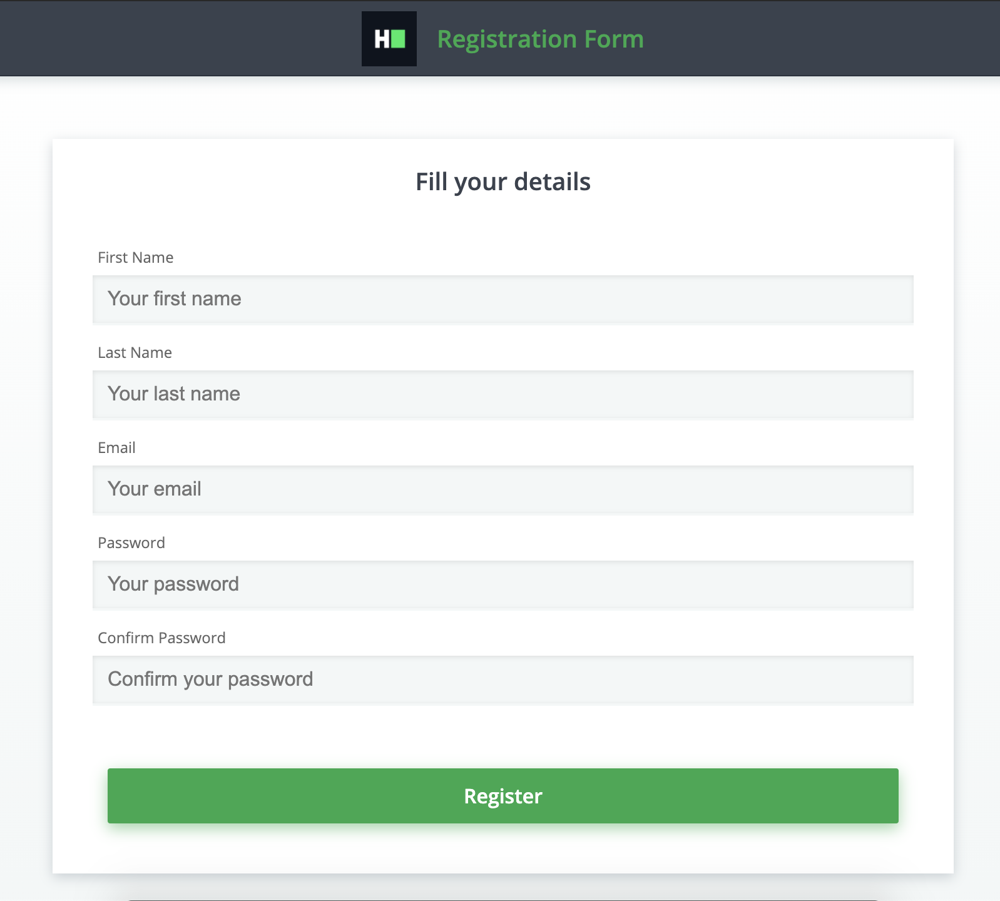

## Environment:
- Java version: 1.8
- Maven version: 3.*
- Selenium HtmlUnitDriver: 2.52.0

## Read-Only Files:
- src/test/*
- website/*

## Form Data
Fill the form with the following data:
- First Name : Fizz
- Last Name : Buzz
- Email : fizz_buzz@hackerrank.com
- Password: fizz_buzz@Hrw
- Confirm password: c_fizz_buzz@Hrw

## Requirements:
In this challenge, you are going to use the Selenium WebDriver, the HtmlUnitDriver, which uses the HtmlUnit headless browser. This means you don't need to set up the browser (like Firefox or Chrome) nor a web driver executable (like FirefoxDriver or ChromeDriver). Every web page has web elements (aka DOM objects) with unique names or ids. Names are usually unique, but this is not a restriction.


There is a class `FormSubmission` that has 2 methods:

1. `fillForm`:
    - This needs to fill the form on the given page. Assume there is only one form on the given page.
    - It has two parameters, web driver and page URL.
2. `submitForm`: 
    - This needs to submit the filled form. Assume this method is called only after the *fillForm* method.
    - It has a single parameter, web driver. Assume the driver has a filled form from the *fillForm* method. 

The page that will be supplied is *website/home.html*, which will look like the following:



Your task is to complete the implementation of these 2 methods so that the unit tests pass while running the tests.

## Commands
- run: 
```bash
mvn clean package; java -jar target/selenium-java-form-submission-1.0.jar
```
- install: 
```bash
mvn clean install
```
- test: 
```bash
mvn clean test
```
